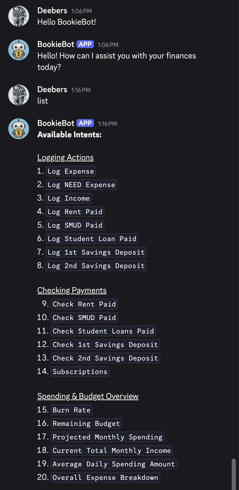
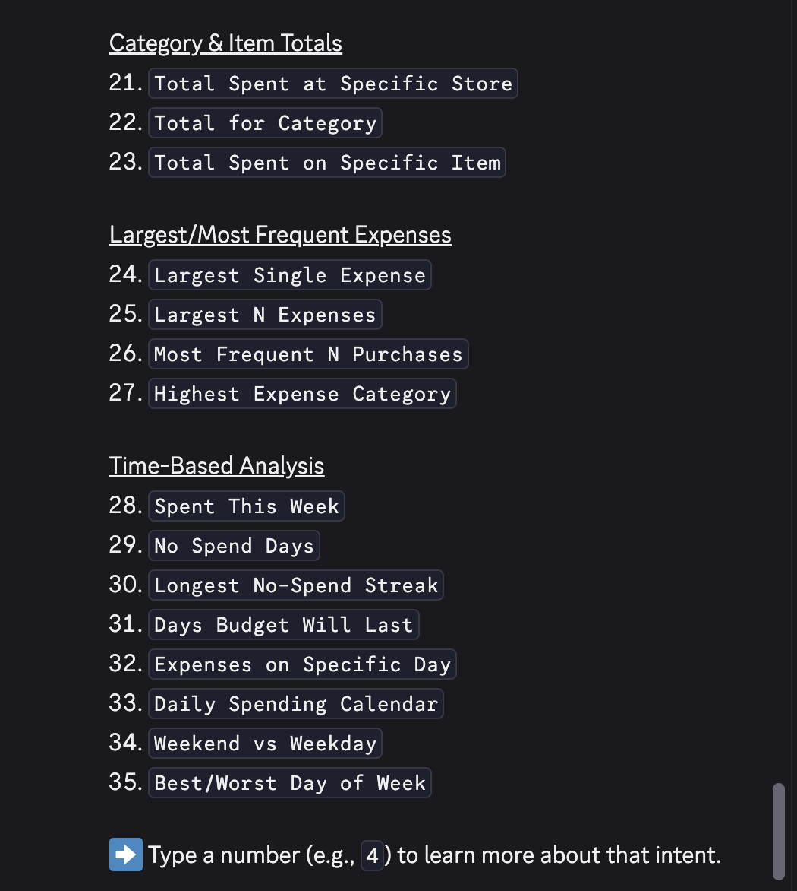
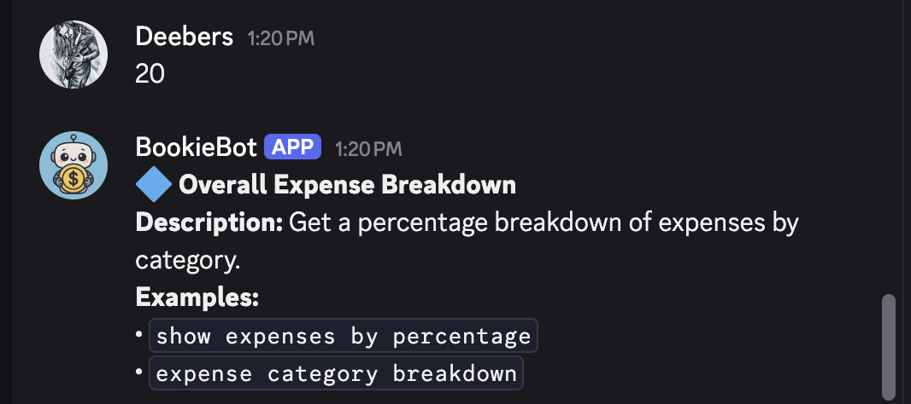
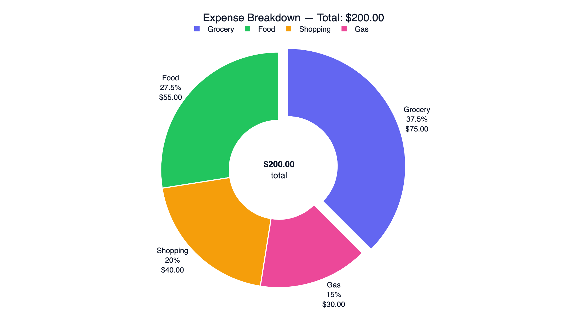
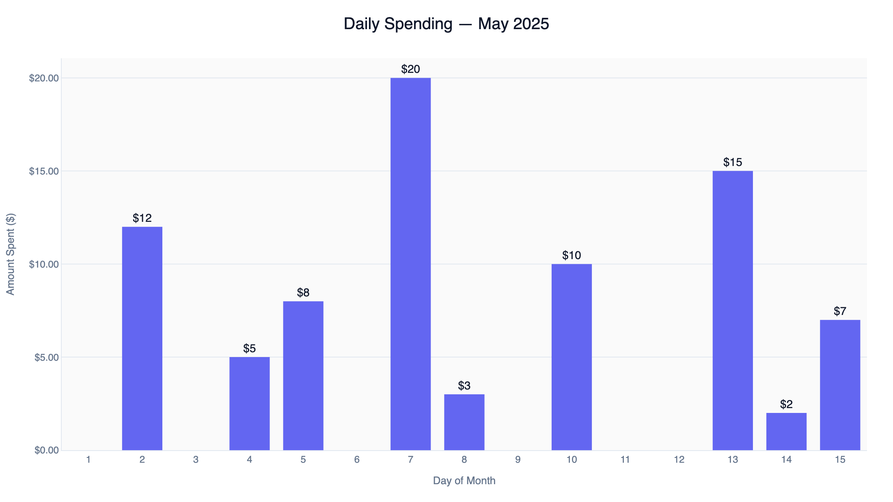
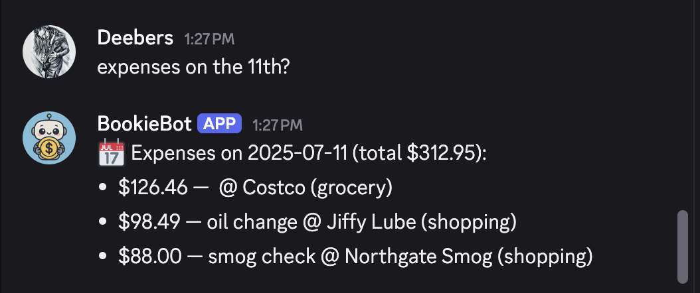
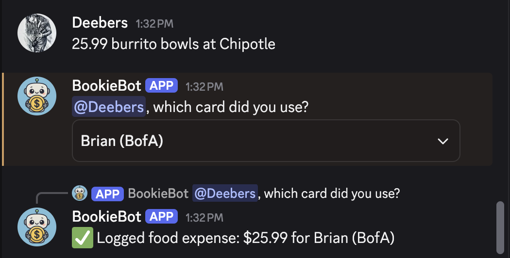
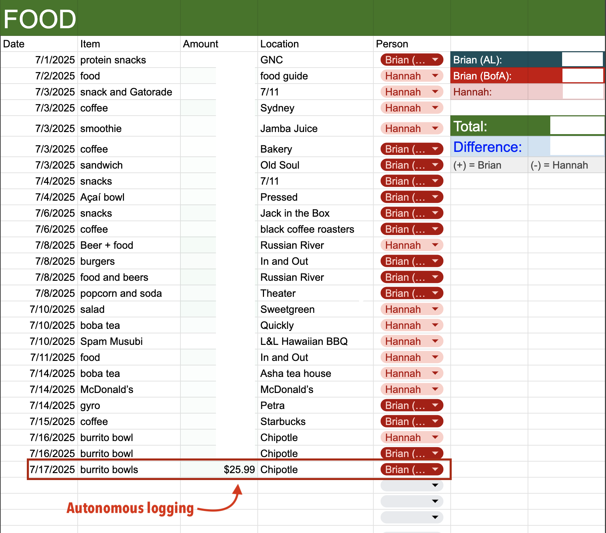

# 📒 BookieBot


BookieBot is an intelligent Discord bot designed to help you track personal expenses and income directly from Discord.\
It leverages agentic AI to understand natural language commands, update a Google Sheet, and provide insightful budget analytics in real time.

## 🚀 Features

- Log expenses, income, rent, utilities, savings, and more via natural language (e.g., *"I spent \$25 on groceries today"*).
- Query financial data easily (e.g., *"What did I spend last week?"*, *"Show me my largest single expense"*).
- Supports dozens of intents including burn rate calculation, category breakdowns, and daily/weekly insights.
- Sends proactive subscription pull-date reminders 7, 3, and 1 day before expected charges.
- Fully integrated with Google Sheets for persistent, transparent data storage.
- Asynchronous and scalable, with clear error handling and feedback messages.

## 🛠️ Tech Stack

- **Python** — main language
- **Discord.py** — Discord bot framework
- **Google Sheets API** — data storage and retrieval
- **OpenAI API** — natural language understanding
- **AsyncIO** — asynchronous event loop and I/O
- **Railway** — deployment platform

## 📄 Example Commands

> 💬 *"Log \$15 for lunch today"*\
> 📋 Bot adds an expense to the Google Sheet.

> 💬 *"What’s my burn rate?"*\
> 📊 Bot calculates and returns your average daily spending.

> 💬 *"Show me my top 3 expenses this month"*\
> 📝 Bot fetches and lists your largest expenses.

## 🎭 Daily Avatar Rotation

BookieBot can rotate its Discord profile picture once per day. Add square avatar images to:

```text
assets/avatars/
```

Supported formats are `.png`, `.jpg`, `.jpeg`, and `.webp`. Rotation is enabled by default when images are present. Set `BOOKIEBOT_AVATAR_ROTATION_ENABLED=false` to disable it, or set `BOOKIEBOT_AVATAR_DIR` to use a different folder.

## Subscription Reminders

BookieBot keeps the visible `Subscriptions` worksheet as the editable source of truth, then syncs it into a hidden per-user worksheet named `_BookieBot Subscription Schedule`. Reminders read from that normalized hidden sheet and fire once after 10 AM Pacific when a charge is 7, 3, or 1 day away. The current block layout is supported, but the hidden sheet uses one row per subscription:

```text
Active | Name | Amount | Kind | Cadence | Pull Day | Pull Date | Account | Reminder Offsets
yes    | ChatGPT | $20.00 | needs | monthly | 21 | | BofA | 7,3,1
yes    | Amazon Prime | $152.90 | needs | yearly | | 10/29 | Amex | 7,3,1
```

Use `Pull Day` for monthly subscriptions and `Pull Date` for yearly subscriptions. Set `BOOKIEBOT_SUBSCRIPTION_REMINDERS_ENABLED=false` to disable the background checker, or set `BOOKIEBOT_SUBSCRIPTION_REMINDER_SEND_HOUR=9` to change the first eligible send hour.

## 📷 Screenshots

### Intent Recognition – Page 1
**Displays the first half of BookieBot’s supported natural language intents, including logging income, tracking rent, utilities, spending breakdowns, and more.**



---

### Intent Recognition – Page 2
**Here are the rest of the LLM intent possibilities.**



---

### Intent Description + Sample Query
**An example of how BookieBot interprets a user message and maps it to a structured command with parameters for downstream processing.**



---

### Expense Breakdown
**BookieBot responding with a categorical breakdown of expenses, grouped by user-defined tags such as food, gas, groceries, and shopping.**



---

### Spending Calendar View
**BookieBot visualizes daily spending across a calendar, highlighting spikes or gaps to help users spot trends or missed logs.**



---

### Expenses on a Specific Day
**Shows how BookieBot retrieves all expenses logged for a specific day, including vendor, category, and total spent.**



---

### Food Log Snapshot
**A sample of a bot-logged food-related expense, showcasing detailed tracking by location and participant as well as payment selection.**



---

### Autonomous Logging
**An annotated Google Sheet pointing to a row logged automatically by BookieBot, confirming autonomous expense tracking throughout the month.**



## 📄 License

MIT License
