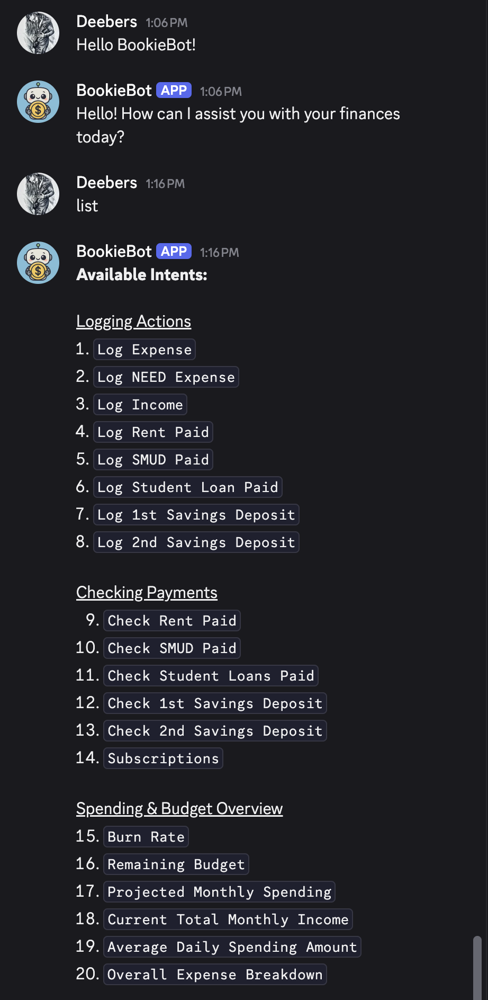
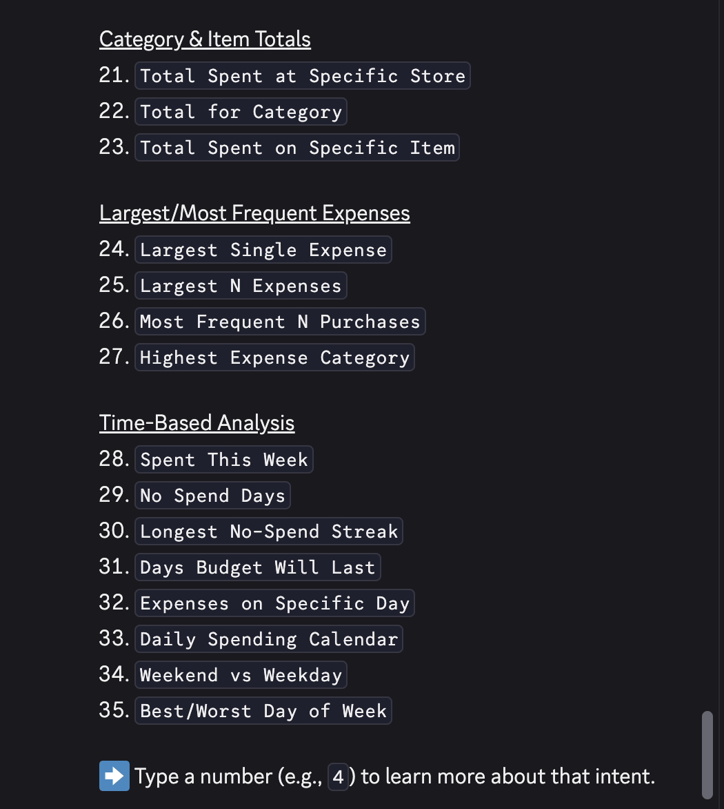
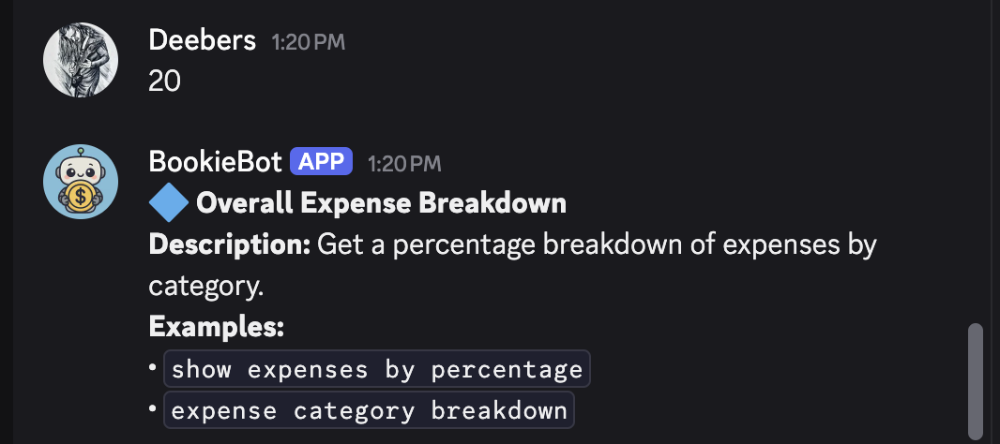
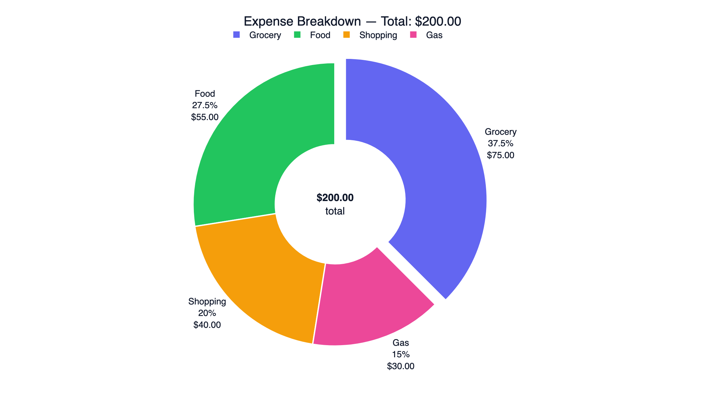
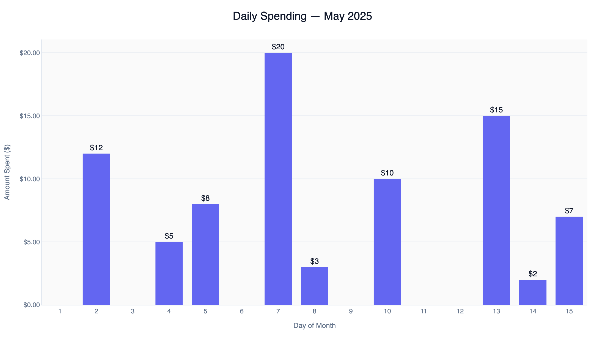
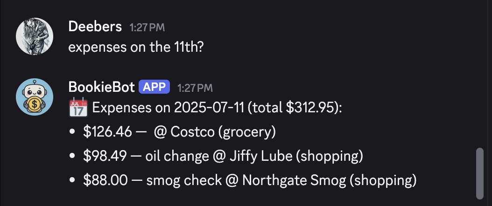
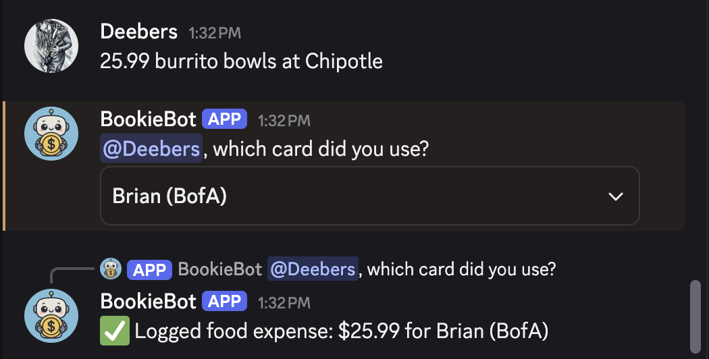
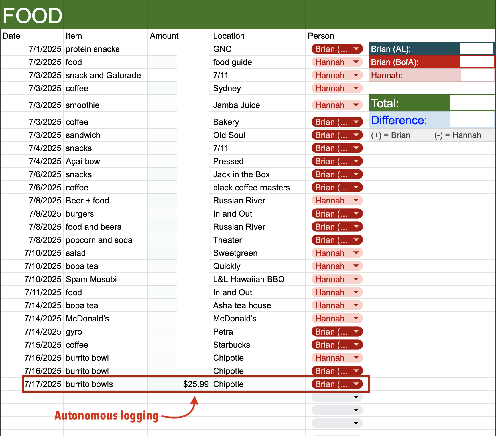

# 📒 BookieBot


BookieBot is an intelligent Discord bot designed to help you track personal expenses and income directly from Discord.\
It leverages agentic AI to understand natural language commands, update a Google Sheet, and provide insightful budget analytics in real time.

## 🚀 Features

- Log expenses, income, rent, utilities, savings, and more via natural language (e.g., *"I spent \$25 on groceries today"*).
- Query financial data easily (e.g., *"What did I spend last week?"*, *"Show me my largest single expense"*).
- Supports dozens of intents including burn rate calculation, category breakdowns, and daily/weekly insights.
- Sends proactive subscription pull-date reminders 7, 3, and 1 day before expected charges.
- Fully integrated with Google Sheets for persistent, transparent data storage.
- Asynchronous and scalable, with clear error handling and feedback messages.

## 🛠️ Tech Stack

- **Python** — main language
- **Discord.py** — Discord bot framework
- **Google Sheets API** — data storage and retrieval
- **OpenAI API** — natural language understanding
- **Plotly + Kaleido** — chart rendering for Discord image attachments (Kaleido 0.2.x for self-contained PNG export on Railway)
- **AsyncIO** — asynchronous event loop and I/O
- **Railway** — deployment platform

## 📄 Example Commands

> 💬 *"Log \$15 for lunch today"*\
> 📋 Bot adds an expense to the Google Sheet.

> 💬 *"What’s my burn rate?"*\
> 📊 Bot calculates and returns your average daily spending.

> 💬 *"Show me my top 3 expenses this month"*\
> 📝 Bot fetches and lists your largest expenses.

## Conversational LangGraph Agent

Messages that do not match a BookieBot command enter a LangGraph conversational agent instead of a stateless generic fallback. Recognized read questions covered by the agent's tools also use this path, so the model interprets live tool data and answers in its own words instead of returning the legacy intent handler's preformatted string. The agent can answer normal questions directly and can combine these read-only tools when a response depends on the requesting user's live BookieBot data:

- Current budget snapshot, income, remaining budget, daily pace, and burn rate
- Category and merchant spending
- Largest expenses and expenses on a requested date
- Subscriptions and current bill-payment status
- The canonical Expense Breakdown dataset, including exact Current and Projected views for income, outflows, savings targets, category budgets/cascade balances, burn rate, scheduled cash flow, commitments, activity, utility history, and reimbursements

For planning questions, the agent uses `get_financial_report` with one focused section (`overview`, `categories`, `cash_flow`, `commitments`, `burn_rate`, `activity`, or `reimbursements`) and a `current`, `projected`, or `comparison` mode. These mode views are calculated on the server and are also consumed by the web report, so an agent answer about Projected income or money left uses the same values as the page's Projected button. Historical months can be requested explicitly.

Bill logging accepts affirmative requests such as `Log rent $2100`, `I paid $2100 for rent`, and `Water bill 148.82`. Bill questions, negation, and planning statements use the read-only conversational path, including while a recent-action amount edit is pending. Updated bill and savings entries retain amount-only editing and cannot delete their budget rows.

Existing command routing remains authoritative for every mutation. The conversational agent cannot log, update, move, split, delete, reconcile, or pay anything. Tool identity comes from the trusted Discord message context rather than model-generated owner arguments, and conversation threads are isolated by guild, channel, and Discord user.

Imperative bank-transfer requests are rejected before intent parsing so wording such as `Transfer $50 from checking to savings` cannot be misread as setting the monthly savings contribution. A completed transfer can still be recorded when the user explicitly asks BookieBot to log it.

The agent uses process-local LangGraph memory by default. Set `BOOKIEBOT_AGENT_DATABASE_URL` for durable Postgres checkpoints; when it is omitted, an existing `BANK_DATABASE_URL` is reused. If neither URL is configured, conversational memory resets when the bot process restarts.

```env
BOOKIEBOT_INTENT_MODEL=gpt-4.1-mini
BOOKIEBOT_AGENT_MODEL=gpt-4.1-mini
BOOKIEBOT_AGENT_DATABASE_URL=
BOOKIEBOT_AGENT_TIMEOUT_SECONDS=45
BOOKIEBOT_AGENT_MAX_MODEL_CALLS=6
BOOKIEBOT_AGENT_MAX_TOOL_CALLS=8
```

## Income Projection Settings

Personal monthly budget sheets use a horizontal green settings grid in **B4:E5**. Labels are in row 4, editable values in row 5; row 6 is blank, and **Date / Source / Amount** starts at **B7:D7**. Income rows can grow or shrink underneath the settings.

| Cell | Setting | Meaning |
| --- | --- | --- |
| B5 | Main Income Source | Employer/source such as `xAI` or `Sonic` |
| C5 | Income Projection Mode | Dropdown: `biweekly` (default), `fixed monthly`, `off` |
| D5 | Expected Income Amount | Expected net amount per paycheck in biweekly mode, or per month in fixed monthly mode |
| E5 | Paycheck Anchor Date | Biweekly only: a known payday, e.g. `7/2/2026` |

For biweekly pay, enter the expected take-home paycheck in D5 and one payday in E5. Scheduled paydays are the anchor itself and every fourteen days afterward indefinitely. The expected amount is never inferred from or overwritten by actual deposits. For example, an expected $3,775 paycheck followed by a $3,100 actual deposit leaves the next payday projected at $3,775; a two-paycheck month projects $6,875 plus any other actual income. Blank, zero, or invalid expected amounts produce no estimated income and the report asks for Expected Income Amount.

Only the configured main source fulfills a paycheck. Matching normalizes case, punctuation, and spacing and accepts the complete employer label with an optional standard suffix: `income`, `paycheck`, `payroll`, `salary`, or `wages`. Thus `xAI`, `xAI paycheck`, and `xAI income` match; `xAI bonus` and credit card rewards do not. Label one-time employer payments distinctly.

A dated matching deposit within **three calendar days before or after** a scheduled payday fulfills that period regardless of amount. Multiple deposits in that window fulfill the same period, without consuming the following paycheck. Undated/out-of-window entries remain actual income without fulfilling a scheduled period. Adjacent month/year receipts are checked to avoid projecting an already-paid boundary payday. Actual dollars and calendar events remain in the month/date received; they are not moved to the scheduled month.

For fixed monthly income, select `fixed monthly` in C5 and enter **monthly take-home income** in D5 once. No annual-salary field or gross-to-net conversion is involved. The date anchor is ignored. Projected income equals actual income plus any unreceived part of the monthly target: a $6,000 target with $3,100 salary and $50 rewards received projects $6,050. The remaining $2,900 appears as a month-end salary remainder estimate. Actual salary above the target is never reduced. `off` and completed-month reports use logged income only.

The Apps Script copies the effective plan into each new month, including validations and formatting. New tabs reference the latest configured prior monthly grid, so corrections flow to future tabs that still inherit their values. Typing a value over a reference creates a monthly override. A changed source does not inherit a different employer's referenced amount/date. January receives the prior year's effective plan through its annual Template. Settings persist through empty months and annual rollover; make ongoing changes in the relevant month. A cleared expected amount explicitly disables the estimate. Source/date blanks retain earlier settings when resolving history.

`upgradeCurrentIncomeSettings()` migrates only the current month and internal Template in both annual budgets. It removes the old E1:F5 grid, inserts three rows above the income header, and updates the affected month's personal-budget action-log and split-ledger row references. Daily rollover never migrates existing tabs or overwrites their explicit settings. Manual income edits stamp dates and repair totals without appending styled placeholder rows. BookieBot still inserts transaction rows when needed and preserves ordinary formatting, totals, and undo behavior. Legacy overlapping-grid safeguards remain only for older tabs and saved actions.

Legacy `Fixed Monthly Income` and `Biweekly Income Source/Start` settings remain readable for historical compatibility. Older grids retain their existing observed-paycheck projection behavior until migrated; the new Expected Income Amount grid always uses the explicit expectation. The web report and read-only report tools expose the same resolved projection basis.

## 🎭 Daily Avatar Rotation

BookieBot can rotate its Discord profile picture once per day. Add square avatar images to:

```text
assets/avatars/
```

Supported formats are `.png`, `.jpg`, `.jpeg`, and `.webp`. Rotation is enabled by default when images are present. Set `BOOKIEBOT_AVATAR_ROTATION_ENABLED=false` to disable it, or set `BOOKIEBOT_AVATAR_DIR` to use a different folder.

## Subscription Reminders

BookieBot keeps the visible `Subscriptions` worksheet as the editable source of truth, then syncs it into a hidden per-user worksheet named `_BookieBot Subscription Schedule`. Reminders fire once per user per day after the configured Pacific send hour and include every subscription expected to pull in the next 7 days.

```text
<@user> `$177.90` will be pulled by subscriptions in the next 7 days.

Today:
`None`

Tomorrow:
`Railway - $5.00 - May 15`

Upcoming:
`ChatGPT - $20.00 - May 17`
`Amazon Prime - $152.90 - May 21`
```

The current block layout is supported. The hidden sheet uses one normalized row per subscription with columns for owner, kind, cadence, amount, pull day/month, reminder offsets, source range, and sync timestamp. BookieBot refreshes this hidden sheet in the background even before the daily notification window, so sheet changes can be normalized automatically before reminders are due. If BookieBot finds malformed visible subscription rows it cannot safely normalize, it sends a concise parse-warning digest and skips those rows until fixed.

For scheduled rows that look like manually tracked bills, such as Rent, PG&E, Recology, or Water, BookieBot checks the existing payment fields and annotates the reminder if no payment has been logged yet. Legacy Student Loan entries remain subscription autopay unless the owner explicitly configures a standalone loan:

```text
Tomorrow:
`PG&E - $140.00 - May 15 (no logged payment yet for this expected tomorrow pull)`
```

Admin/debug support:

```text
/debug_subscriptions
```

This command forces a sync, lists parsed subscriptions, and reports skipped rows. Set `BOOKIEBOT_SUBSCRIPTION_REMINDERS_ENABLED=false` to disable the background checker, or set `BOOKIEBOT_SUBSCRIPTION_REMINDER_SEND_HOUR=9` to change the first eligible send hour.

Per-user send-hour overrides are also supported:

```env
BRIAN_SUBSCRIPTION_REMINDER_SEND_HOUR=10
HANNAH_SUBSCRIPTION_REMINDER_SEND_HOUR=8
```

## Standalone Student Loans And Expected Bills

An optional `expected_amount` column in `_BookieBot Bill Schedule` supplies a recurring estimate without recording a payment. A valid schedule and one exact source row are required. Projected includes the estimate only while that current/future month's actual cell is blank or zero; Current and historical payment charts use recorded amounts. A recorded payment replaces the estimate regardless of its amount. Calendar and canonical widget/report calculations share that rule.

A standalone Student Loan additionally requires explicit positive `expected_amount` configuration. Brian’s schedule is **$59.96 monthly on the 12th**. `Log student loan $59.96` records the authenticated author's actual current-month payment total; `Did I pay my student loan?` reads it. The guarded writer uses named ranges that move with row insertions, verifies the result and retains payment undo metadata with an exact source label. It never infers payment from a due date or changes another person's subscription autopay. A matching active subscription prevents standalone logging and suppresses a duplicate estimated bill. Monthly tabs use the annual schedule and internal Template; new annual workbooks come from separate master templates and must carry the row/configuration too. See the [student-loan audit and activation checklist](docs/STUDENT_LOAN_INTEGRATION.md).

The loan remains a Needs **bill**, displayed under **Static Bills & Subscriptions** and in Calendar’s fixed-bill details, with Scheduled/Recorded amount provenance. It is excluded from the variable Bills & Utilities trend chart. Burn Rate counts Food, Shopping and Wants subscriptions only; a Needs bill affects its Wants allowance through the existing category coverage rules, never by becoming Wants spending. Both canonical modes, report details and widgets preserve fixed bill amounts alongside subscription totals.

## Bank Integration And Confirmed Imports

The Plaid integration stores encrypted access tokens outside Google Sheets, fetches accounts, and syncs transactions through `/transactions/sync`. Reconciliation matches bank items to logged entries. Writing a new expense or income/refund requires explicit confirmation in the review form.

Required environment variables:

```env
PLAID_CLIENT_ID=
PLAID_SECRET=
PLAID_ENV=sandbox
BANK_TOKEN_ENCRYPTION_KEY=
BANK_DATABASE_URL=
BANK_SQLITE_PATH=data/banking.sqlite3
```

On Railway, `data/banking.sqlite3` is not durable across redeploys unless a persistent volume is mounted. For Sandbox testing, use `/debug_bank_seed_sandbox` after each redeploy. Before linking real bank accounts, use Railway Postgres and set `BANK_DATABASE_URL`; SQLite should remain local/Sandbox-only unless it is backed by a mounted volume.

Admin/debug commands:

```text
/debug_bank_status
/debug_bank_seed_sandbox
/debug_bank_sandbox_link
/debug_bank_sync
/debug_bank_transactions
/debug_bank_reconcile
```

Bank imports currently support posted transactions dated in the current month only. Previous/future months and invalid dates are rejected before writing; historical items can still be matched to existing rows. This restriction remains until historical destination-aware undo is supported.

A durable import operation prevents duplicate writes from repeated forms or retries. If a write outcome is uncertain, the item remains in review. Reconcile Now can recover its uniquely tagged action-log entry without writing another row. An operation without a reliable action record requires inspection of the sheet and action history; waiting or reopening an old form never resets the claim.

## Expense Report Access

Use **`/expense_app`** from your own Discord account to install your personal iPhone Home Screen app. A fresh launch opens Overview for the current month; the month heading lets you browse available history. The selected report refreshes on launch/foreground return or through the refresh icon. **`/expense_app_reset`** revokes your phone access. Sessions last up to 180 days from setup; opening the app does not extend that deadline. See [phone setup, dashboard, and deployment instructions](docs/PHONE_APP_SETUP.md), including reconnecting an existing icon. The icon reuses BookieBot's piggy-bank avatar; the avatar inside the app rotates daily.

- **Four screens:** the Konsta navigation bar opens **Overview** (four headline metrics, comparisons and all four graphs), **Spending** (daily spending and largest/frequent expenses), **Shared**, and **Savings**. It becomes compact while scrolling down and expands when scrolling up. Switching tabs preserves each screen's scroll position and open controls/forms during the current app session. **Settings**, opened with the header gear, contains appearance, phone notifications, account/signout and app updates. Overview and Spending share the selected month and Current/Projected view; canonical reimbursements and savings span months.
- **Explore the numbers:** tap a Category Mix slice or Daily Spending bar/day to inspect its entries. Tap the Income, Spent, Left, or Saved label to see the calculation for the active Current/Projected view. Details distinguish recorded transactions, scheduled estimates, and sheet-only amounts.
- **Compare history:** choose a report month, then open **Compare spending**. Both the main month heading and **Compare with** open Konsta month-grid popovers with year arrows, a highlighted selection, and unavailable months disabled. Comparisons default to the previous month and use matching calendar days and dated recorded spending, with missing dates, scheduled subscriptions, and incomplete coverage explained. Choosing the current month in the main picker restores automatic current-month behavior. Historical availability depends on configured annual workbooks and existing monthly tabs.
- **Shared reimbursements:** see **Owed to you** and **You owe**, record full/partial payments, confirm money reported sent by the other person, and review equal offsets across opposing debts. The payer keeps the full purchase until repayment is confirmed; confirmation reduces that original expense and records the debtor’s linked repayment expense. No money is transferred or logged as income. The canonical ledger uses the existing durable phone database; reviewed migration and `BOOKIEBOT_REIMBURSEMENTS_ENABLED=true` enable the new workflow. See [reimbursement behavior, rollout and recovery](docs/REIMBURSEMENTS.md).
- **Keep your preferred view:** each phone remembers its Current/Projected choice and chart, scoped by owner. A deployed frontend change offers **Update** or **×** in a toast. Dismissing hides that exact version's notice for the browser/app session; the update remains available in **Settings → About & updates**, and a different version can show a new notice. Checking never forces a reload. Update and signout wait for pending changes or Ask requests and unresolved financial outcomes; unsaved drafts require keeping them or explicitly discarding them. Data refresh and app updates are separate.
- **Ask about the report:** a compact Konsta glass toolbar keeps chat and Settings visible at the top right while scrolling. Chat opens **Ask BookieBot** in a floating side panel from any screen, with the selected month and Current/Projected context visible. Closing and reopening retains the draft, answer and ongoing request; changing month/view clears them. Source buttons finish dismissing the panel before opening the relevant screen/section. Questions use read-only tools bound to the authenticated owner through the existing AI service, keep no server conversation history, and cannot modify sheets or move money.
- **Optional phone notifications:** installed iPhone web apps on iOS 16.4+ can opt in through **Settings → Notifications → Enable on this phone**. Nothing subscribes automatically. The initial choice is a Monday check-in at 10 AM Pacific with Lock Screen amounts hidden; next-day scheduled-payment reminders are optional and additional to Discord reminders. Each phone/session has its own preferences, which save automatically once enabled, and **Send a test** sends only after an explicit tap. Signout, expiry, or access reset stops future sends. [WebKit requirements](https://webkit.org/blog/13878/web-push-for-web-apps-on-ios-and-ipados/)
- **Savings:** see the total recorded across all personal goals, including archived goals; create personal targets with a starting balance and optional date, record contributions, reverse a contribution, and edit/archive/restore goals. These are durable manual allocations, separate from monthly Saved and bank balances. They never transfer money or write savings entries into budget sheets.

Optional **Scriptable Home Screen widgets** pair through **Settings → Widgets**. **Budget**, **Upcoming payments**, **Savings goal**, **Category budgets**, and **Shared balance** each support Small/Medium and **Editorial** / **Two-tone**. **Setup & widgets → Customize** supplies the type/theme/optional goal parameter for each Home Screen instance; all can share one pairing. Compact connection rows retain mode and **⋯ → Last checked / Remove**. Each person gets separate, revocable read-only access; no native build or Apple developer membership is required. Replace the existing source with **v1.4** without renaming or re-pairing. Existing blank/theme-only widgets remain Budget. Website updates do not replace downloaded scripts. A populated widget opens BookieBot in the browser, which may need its own sign-in. See [types, setup, refresh and recovery](docs/SCRIPTABLE_WIDGETS.md).

Phone sessions, savings goals, widget pairings/grants, and notification settings use durable storage: `BOOKIEBOT_APP_DATABASE_URL`, existing `BANK_DATABASE_URL`, or `DATABASE_URL`, in that order. Railway can alternatively use a mounted volume; ephemeral session storage is refused. This feature does not require Plaid. Push signing keys are created once and retained in that database; no manual key setup is required. The web app does not cache report values for offline use. The optional widget retains a minimal local snapshot with its original timestamp and explicit stale state; its server cache reuses at most five minutes of canonical source data. Widget access is separate from web sign-in; `/expense_app_reset` revokes both for that owner.

Live and saved expense reports require an unexpired signed report link. Direct filename links also need the token issued for that exact file. Responses are private and are not cached. If live refresh fails, a valid link can still show its saved snapshot.

Live builds run outside the Discord event loop. `BOOKIEBOT_REPORT_MAX_CONCURRENT_BUILDS` defaults to `2` (supported range `1`–`8`); simultaneous requests for the same actor/month share work, while later refreshes read current sheet values. Fresh reports batch required tabs per workbook (one metadata read and one formatted values batch). Comparisons batch all available months of each requested year and retain only their comparison inputs in bounded process memory for at most 60 seconds; month discovery uses the same short reuse window. Every regular refresh bypasses and invalidates these history reads. A 10-second handoff can also reuse the just-refreshed selected report. Failed reads are never cached, and old in-flight history cannot repopulate the cache after refresh. Sheets sockets have finite timeouts; source throttling gets explicit feedback and Retry-After rather than a misleading connection error. Report reads never create missing worksheets.

## Verification

Pushes and pull requests run `.github/workflows/ci.yml`: Python unit tests and Pyright, SQLite/Postgres lifecycle contracts, Apps Script migration/rollover checks, and report typecheck/build with committed-asset parity.

Local Postgres contracts are opt-in through `BOOKIEBOT_TEST_POSTGRES_URL` pointing to a disposable test database. Each case creates and removes its own random schema. Without that variable, only the Postgres cases skip; the tests never use `BANK_DATABASE_URL`.

```bash
PYTHONPATH=src python -m pytest unit_tests
PYTHONPATH=src python -m pyright
node unit_tests/scripts/income_settings_test.cjs
```

The autofix workflow reads incident and failure text from files; PR metadata is generated by `scripts/build_autofix_pr.py` without embedding payload contents in shell code.

## 📷 Screenshots

### Intent Recognition – Page 1
**Displays the first half of BookieBot’s supported natural language intents, including logging income, tracking rent, utilities, spending breakdowns, and more.**



---

### Intent Recognition – Page 2
**Here are the rest of the LLM intent possibilities.**



---

### Intent Description + Sample Query
**An example of how BookieBot interprets a user message and maps it to a structured command with parameters for downstream processing.**



---

### Expense Breakdown
**BookieBot responding with a categorical breakdown of expenses, grouped by user-defined tags such as food, gas, groceries, and shopping.**



---

### Spending Calendar View
**BookieBot visualizes daily spending across a calendar, highlighting spikes or gaps to help users spot trends or missed logs.**



---

### Expenses on a Specific Day
**Shows how BookieBot retrieves all expenses logged for a specific day, including vendor, category, and total spent.**



---

### Food Log Snapshot
**A sample of a bot-logged food-related expense, showcasing detailed tracking by location and participant as well as payment selection.**



---

### Autonomous Logging
**An annotated Google Sheet pointing to a row logged automatically by BookieBot, confirming autonomous expense tracking throughout the month.**



## 📄 License

MIT License
