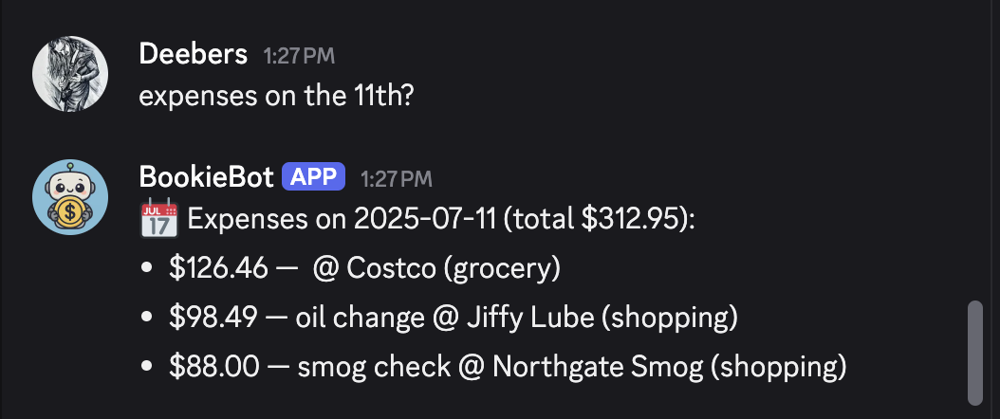

# 📒 BookieBot

BookieBot is an intelligent Discord bot designed to help you track personal expenses and income directly from Discord.\
It leverages agentic AI to understand natural language commands, update a Google Sheet, and provide insightful budget analytics in real time.

## 🚀 Features

- Log expenses, income, rent, utilities, savings, and more via natural language (e.g., *"I spent \$25 on groceries today"*).
- Query financial data easily (e.g., *"What did I spend last week?"*, *"Show me my largest single expense"*).
- Supports dozens of intents including burn rate calculation, category breakdowns, and daily/weekly insights.
- Fully integrated with Google Sheets for persistent, transparent data storage.
- Asynchronous and scalable, with clear error handling and feedback messages.

## 🛠️ Tech Stack

- **Python** — main language
- **Discord.py** — Discord bot framework
- **Google Sheets API** — data storage and retrieval
- **OpenAI API** — natural language understanding
- **AsyncIO** — asynchronous event loop and I/O
- **Railway** — deployment platform

## 📄 Example Commands

> 💬 *"Log \$15 for lunch today"*\
> 📋 Bot adds an expense to the Google Sheet.

> 💬 *"What’s my burn rate?"*\
> 📊 Bot calculates and returns your average daily spending.

> 💬 *"Show me my top 3 expenses this month"*\
> 📝 Bot fetches and lists your largest expenses.

## 📷 Screenshots

### Intent Recognition – Page 1
**Displays the first half of BookieBot’s supported natural language intents, including logging income, tracking rent, utilities, spending breakdowns, and more.**

---

### Intent Recognition – Page 2
**Here are the rest of the LLM intent possibilities.**

---

### Intent Description + Sample Query
**An example of how BookieBot interprets a user message and maps it to a structured command with parameters for downstream processing.**

---

### Expense Breakdown
**BookieBot responding with a categorical breakdown of expenses, grouped by user-defined tags such as food, gas, groceries, and shopping.**

---

### Spending Calendar View
**BookieBot visualizes daily spending across a calendar, highlighting spikes or gaps to help users spot trends or missed logs.**

---

### Expenses on a Specific Day
**Shows how BookieBot retrieves all expenses logged for a specific day, including vendor, category, and total spent.**

---

### Food Log Snapshot
**A sample of a bot-logged food-related expense, showcasing detailed tracking by location and participant as well as payment selection.**

---

### Autonomous Logging
**An annotated Google Sheet pointing to a row logged automatically by BookieBot, confirming autonomous expense tracking throughout the month.**

## 📄 License

MIT License

Smoke test: success ✅
